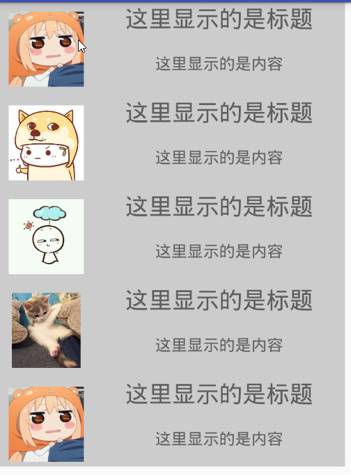
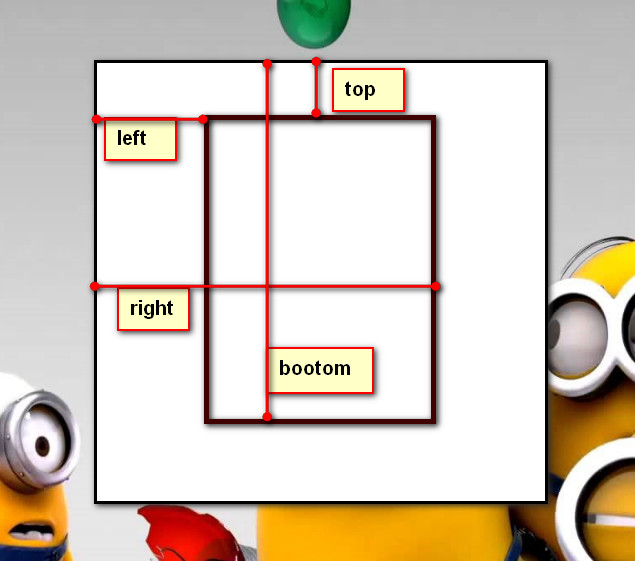
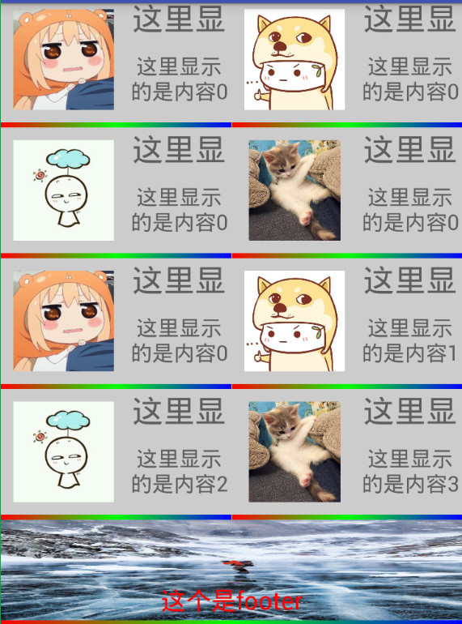
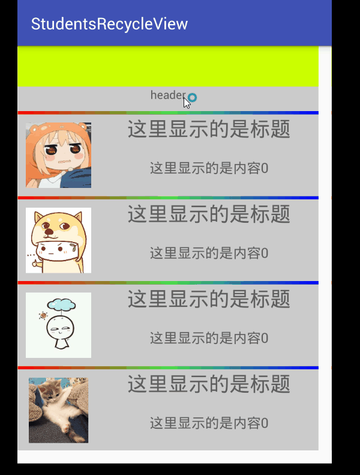
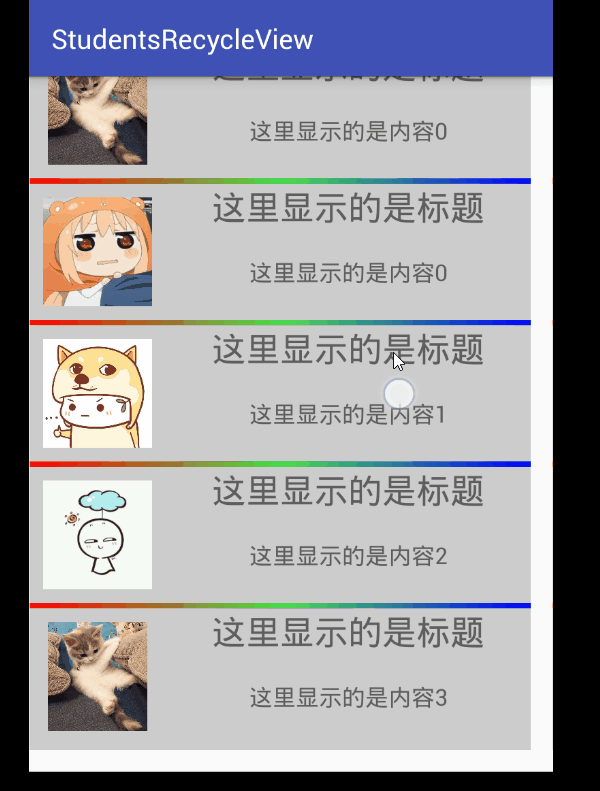

# RecyclerView基础使用

1. 添加依赖
```
compile 'com.android.support:recyclerview-v7:25.3.0'
```

2. 创建bean对象

这里的bean对象可以写成两个部分，一部分表示原始数据，一部分在RecycelView进行显示。
这样说可能有点抽象，举个例子说明。我需要显示如图的样式：


我创建两个bean对象，一个用于数据的传递，一个在adapter中用于item的显示。InfoBean用于控制数据。ItemHolder用于显示数据
代码请参考:
infoBean对象如下：

```
package com.hut.reoger.studentsrecycleview.bean;

/**
 * Created by 24540 on 2017/3/28.
 */

public class InfoBean {
    private int id;
    private String title;
    private String content;

    public int getId() {
        return id;
    }

    public void setId(int id) {
        this.id = id;
    }

    public String getTitle() {
        return title;
    }

    public void setTitle(String title) {
        this.title = title;
    }

    public String getContent() {
        return content;
    }

    public void setContent(String content) {
        this.content = content;
    }
}

```

ItemHolder代码如下：
```

public class ItemHolder extends RecyclerView.ViewHolder{
    public ImageView imageView;
    public TextView teTitle;
    public TextView teContent;


    public ItemHolder(View itemView) {
        super(itemView);

        imageView = (ImageView) itemView.findViewById(R.id.item_image);
        teTitle = (TextView) itemView.findViewById(R.id.item_title);
        teContent = (TextView) itemView.findViewById(R.id.item_content);
    }
}

```
这里需要记住的是，这个类需要继承ViewHolder。当然，这个类写在adapter中也完全是ok的。

3. 创建adapter对象
详细参照例子，这里提出要点：
* 继承RecyclerView.Adapter<T>
* 实现继承的方法。
* 利用onCreateViewHolder方法创建ViewHolder
* 利用onBindViewHolder方法显示具体内容
* 利用getItemCount总计数据的总数


4.创建item布局和主布局
    这一点比较简单，不做解释
    
    
5. 在主界面显示recyclerView
这一点同普通的listView实现基本相同，有一点需要注意的是：在显示之前需要为recyclerVIew设置布局。
关键代码如下：
```
RecyclerView.LayoutManager mManager = new LinearLayoutManager(this, LinearLayoutManager.VERTICAL, false);
mRecyclerView.setLayoutManager(mManager);
```

基本上到这里，就差不多完成了。

# 

在RecycleView中，并没有直接为Item开放OnItemClick等点击事件，这需要我们自己动手来完成。
下面介绍三中比较常用的方法来实现添加点击事件。

## 在adapter中添加点击事件
比较常见的一种方法。在使用listView时，我们有时候也会使用这种方法来实现添加点击事件。因为在
adapter中添加点击事件的可以实现最item子view点击事件的监控。
思路如下：</br>
在adapter中新建并暴露自己定义的接口类型。
```
private OnRecyclerViewItemClickListener mOnItenClickListener = null;
private OnRecyclerViewItemLongClickListener mOnItemLongClickListener = null;

public void setOnItemClickListener(OnRecyclerViewItemClickListener listener){
    this.mOnItenClickListener = listener;
}

public void setOnItemLongClickListener(OnRecyclerViewItemLongClickListener listener){
    this.mOnItemLongClickListener = listener;
}
```
在adapter中添加对指定元素的的点击事件。
```
v.setOnLongClickListener(new View.OnLongClickListener() {
        @Override
        public boolean onLongClick(View v) {
            if(mOnItemLongClickListener!=null)
            mOnItemLongClickListener.OnItemLongClickListener(v, (Integer) v.getTag());
            return false;
        }
    });
```
在接口调用中，调用自己定义的接口来进行实现。
```

@Override
public void onClick(View v) {
    if(mOnItemLongClickListener !=null)
    mOnItenClickListener.OnItemClickListener(v, (Integer) v.getTag());
}
```
在activity中调用接口实现监听
```
mMyAdapter.setOnItemClickListener(new MyAdapter.OnRecyclerViewItemClickListener() {
           @Override
           public void OnItemClickListener(View view, int position) {
               Toast.makeText(MainActivity.this,"通过方法3实现的点击事件"+position,Toast.LENGTH_SHORT).show();
           }
       });
       mMyAdapter.setOnItemLongClickListener(new MyAdapter.OnRecyclerViewItemLongClickListener() {
           @Override
           public void OnItemLongClickListener(View view, int position) {
               Toast.makeText(MainActivity.this,"通过方法3实现的点击事件长安"+position,Toast.LENGTH_SHORT).show();
           }
       });
```

## 通过重写GestureDetectorCompat实现监听
虽然RecycleView没有直接实现对应的点击事件，但是在它给我们提供的api中，会发现它还是给我们预留了接口来进行实现
。通过重写GestureDetectorCompat来实现对item点击事件的监控。
```
 private GestureDetectorCompat gestureDetectorCompat;

    public interface OnItemClickListener{
        void onItemClick(View view, int position);
        void onItemLongClick(View view,int postion);
    }

    public ItemClickListener(final RecyclerView recyclerView,final OnItemClickListener clickListener) {
        gestureDetectorCompat = new GestureDetectorCompat(recyclerView.getContext(),
                new GestureDetector.SimpleOnGestureListener(){
                    @Override
                    public boolean onSingleTapUp(MotionEvent e) {
                        View childView = recyclerView.findChildViewUnder(e.getX(),e.getY());
                        if(childView != null && clickListener!= null){
                            clickListener.onItemClick(childView,recyclerView.getChildAdapterPosition(childView));
                        }
                        return true;
                    }

                    @Override
                    public void onLongPress(MotionEvent e) {
                        View childView = recyclerView.findChildViewUnder(e.getX(),e.getY());
                        if(childView != null && clickListener != null){
                            clickListener.onItemLongClick(childView,recyclerView.getChildAdapterPosition(childView));
                        }
                    }
                });
    }

    @Override
    public boolean onInterceptTouchEvent(RecyclerView rv, MotionEvent e) {
        gestureDetectorCompat.onTouchEvent(e);
        return false;
    }

```

在Activity中进行调用，可以参照下面：
```
mRecyclerView.addOnItemTouchListener(new ItemClickListener(mRecyclerView, new ItemClickListener.OnItemClickListener() {
   @Override
   public void onItemClick(View view, int position) {
       Toast.makeText(MainActivity.this, "通过方法1实现的点击事件" + position, Toast.LENGTH_SHORT).show();
   }

   @Override
   public void onItemLongClick(View view, int position) {
       Toast.makeText(MainActivity.this, "通过方法1实现的点击事件" + position, Toast.LENGTH_SHORT).show();
   }
}));
```

## 利用OnChildAttachStateChangeListener来实现
参照博客<http://www.littlerobots.nl/blog/Handle-Android-RecyclerView-Clicks/>
```
package com.hut.reoger.studentsrecycleview.addClickListener;

import android.support.v7.widget.RecyclerView;
import android.view.View;

import com.hut.reoger.studentsrecycleview.R;

/**
 * Created by 24540 on 2017/3/28.
 * 为Item添加点击事件：方法二：利用OnChildAttachStateChangeListener来实现
 * 同时，使用方法，可以实现对item子控件的监听，具体实现参见类：
 * 参考链接：http://www.littlerobots.nl/blog/Handle-Android-RecyclerView-Clicks/
 */

public class ItemClickSupport {
    private final RecyclerView mRecyclerView;
    private OnItemClickListener mOnItemClickListener;
    private OnItemLongClickListener mOnItemLongClickListener;

    private View.OnClickListener mOnClickListener = new View.OnClickListener() {
        @Override
        public void onClick(View v) {
            if (mOnItemClickListener != null) {
                RecyclerView.ViewHolder holder = mRecyclerView.getChildViewHolder(v);
                mOnItemClickListener.onItemClicked(mRecyclerView, holder.getAdapterPosition(), v);
            }
        }
    };

    private View.OnLongClickListener mOnLongClickListener = new View.OnLongClickListener() {
        @Override
        public boolean onLongClick(View v) {
            if (mOnItemLongClickListener != null) {
                RecyclerView.ViewHolder holder = mRecyclerView.getChildViewHolder(v);
                return mOnItemLongClickListener.onItemLongClicked(mRecyclerView, holder.getAdapterPosition(), v);
            }
            return false;
        }
    };

    private RecyclerView.OnChildAttachStateChangeListener mAttachListener
            = new RecyclerView.OnChildAttachStateChangeListener() {
        @Override
        public void onChildViewAttachedToWindow(View view) {
            if (mOnItemClickListener != null) {
                view.setOnClickListener(mOnClickListener);
            }
            if (mOnItemLongClickListener != null) {
                view.setOnLongClickListener(mOnLongClickListener);
            }
        }

        @Override
        public void onChildViewDetachedFromWindow(View view) {}
    };

    private ItemClickSupport(RecyclerView recyclerView) {
        mRecyclerView = recyclerView;
        mRecyclerView.setTag(R.id.item_click_support, this);
        mRecyclerView.addOnChildAttachStateChangeListener(mAttachListener);
    }

    public static ItemClickSupport addTo(RecyclerView view) {
        ItemClickSupport support = (ItemClickSupport) view.getTag(R.id.item_click_support);
        if (support == null) {
            support = new ItemClickSupport(view);
        }
        return support;
    }

    public static ItemClickSupport removeFrom(RecyclerView view) {
        ItemClickSupport support = (ItemClickSupport) view.getTag(R.id.item_click_support);
        if (support != null) {
            support.detach(view);
        }
        return support;
    }

    public ItemClickSupport setOnItemClickListener(OnItemClickListener listener) {
        mOnItemClickListener = listener;
        return this;
    }

    public ItemClickSupport setOnItemLongClickListener(OnItemLongClickListener listener) {
        mOnItemLongClickListener = listener;
        return this;
    }

    private void detach(RecyclerView view) {
        view.removeOnChildAttachStateChangeListener(mAttachListener);
        view.setTag(R.id.item_click_support, null);
    }

    public interface OnItemClickListener {
        void onItemClicked(RecyclerView recyclerView, int position, View v);
    }

    public interface OnItemLongClickListener {
        boolean onItemLongClicked(RecyclerView recyclerView, int position, View v);
    }
}

```
在MainActivity监听如下：
```
  ItemClickSupport.addTo(mRecyclerView).setOnItemClickListener(new ItemClickSupport.OnItemClickListener() {
               @Override
               public void onItemClicked(RecyclerView recyclerView, int position, View v) {
                    Toast.makeText(MainActivity.this,"通过方法2实现的点击事件"+position,Toast.LENGTH_SHORT).show();
               }
           });
           ItemClickSupport.addTo(mRecyclerView).setOnItemLongClickListener(new ItemClickSupport.OnItemLongClickListener() {
               @Override
               public boolean onItemLongClicked(RecyclerView recyclerView, int position, View v) {
                   Toast.makeText(MainActivity.this,"通过方法2实现的点击事件长安"+position,Toast.LENGTH_SHORT).show();
                   return false;
               }
           });
```
用这种方法，也可以实现对item的子view进行监控。具体实现可以参见我的代码。

综上，三种方法都可以实现对item点击事件的监控。
方法1和方法3都可以实现对item的子view实现监听。
方法2可以很方便实现对获取点击位置信息。
方法1附加在adapter中，代码有点耦合，不推荐使用方法1。


# 为RecyclerView添加header和footer

为recyclerView添加header和footer也是我们在开发过程中经常遇见的，实现起来也是比较简单的。下面介绍怎么添加header和footer

其实我们可以将header和footer看做是特殊的item，在添加他之后，我们值需要对他进行一些特殊的处理就可以达到我们想到的效果。

为了简单起见，我们直接在adapter中进行这一部分的操作。

在adapter中新建一些标识的int值，用于区分是否需要添加header和footer，如下所示：
```
public static final int TYPE_HEADER = 0;  //说明是带有Header的
public static final int TYPE_FOOTER = 1;  //说明是带有Footer的
public static final int TYPE_NORMAL = 2;  //说明是不带有header和footer的
```

对外暴露添加header和footer方法，参考如下：

```
private View mHeaderView;
private View mFooterView;

public void setHeaderView(View headerView) {
        mHeaderView = headerView;
        notifyItemInserted(0);
    }

    public void setFooterView(View footerView) {
        mFooterView = footerView;
        notifyItemInserted(getItemCount() - 1);
    }
```

覆写getItemViewType()方法，用于区分是否需要添加head和footer
```
 @Override
    public int getItemViewType(int position) {
        if (mHeaderView == null && mFooterView == null) {
            return TYPE_NORMAL;
        }
        if (position == 0) {
            return TYPE_HEADER;
        }
        if (position == getItemCount() - 1) {
            return TYPE_FOOTER;
        }
        return TYPE_NORMAL;
    }
```

在onCreateViewHolder中添加对header和footer的支持
```
if (mHeaderView != null && viewType == TYPE_HEADER) {
    return new ItemHolder(mHeaderView);
}
if (mFooterView != null && viewType == TYPE_FOOTER) {
    return new ItemHolder(mFooterView);
}
```
在onBindViewHolder增加对header和footer的处理，如果当前对象是header或者footer直接返回即可。
如果有header的话，因为header也需要占一个位子，所以显示的时候需要显示当前位子的前一个位子。
```
if (getItemViewType(position) == TYPE_HEADER) return;
else if (getItemViewType(position) == TYPE_FOOTER) return;
else {
    if (holder instanceof MyAdapterWith.ItemHolder) {
        position = holder.getLayoutPosition();
        position = mHeaderView == null ? position : position - 1;
        //计算当前的位置，如果添加了header的话，header也需要占用一个位置
        if (position < datas.size()) {
            holder.imageView.setImageResource(datas.get(position).getId());
            holder.teTitle.setText(datas.get(position).getTitle());
            holder.teContent.setText(datas.get(position).getContent());
        }
    }
}
```
然后，需要在ViewHolder中添加对header和footer的支持
```
  public class ItemHolder extends RecyclerView.ViewHolder {
        public ImageView imageView;
        public TextView teTitle;
        public TextView teContent;


        public ItemHolder(View itemView) {
            super(itemView);
            if (itemView == mHeaderView)
                return;
            if (itemView == mFooterView)
                return;

            imageView = (ImageView) itemView.findViewById(R.id.item_image);
            teTitle = (TextView) itemView.findViewById(R.id.item_title);
            teContent = (TextView) itemView.findViewById(R.id.item_content);
        }
```
最后，我们就可以直接在activity中进行添加了
```
View view  = LayoutInflater.from(this).inflate(R.layout.head,mRecyclerView,false);
mMyAdapter.setHeaderView(view);
View footer = LayoutInflater.from(this).inflate(R.layout.foot,mRecyclerView,false);
mMyAdapter.setFooterView(footer);
```

其中```R.layout.head```和```R.layout.foot```是head和foot的布局。

当然。这样写好之后，我们可以观察到这样的结果：


基本正常，但是当我们使用GridLayoutManager时，会发现这样的问题。

可以看到，这里我们的header和footer被当作一个item，并没有实现我们想到的置顶占行的效果。
解决方案：
利用GridLayoutManager的setSpanSizeLookup方法：
```
gridLayoutManager.setSpanSizeLookup(new GridLayoutManager.SpanSizeLookup() {
    @Override
    public int getSpanSize(int position) {
        if (getItemViewType(position) == TYPE_HEADER || getItemViewType(position) == TYPE_FOOTER)
            return gridLayoutManager.getSpanCount();
        else
            return 1;
    }
});
```
这里的getSpanSize()方法返回的值决定了每个position上item占据的单元格个数。为了简单起见，可以将这个方法放在adapter中。代码如下：
```
 @Override
    public void onAttachedToRecyclerView(RecyclerView recyclerView) {
        super.onAttachedToRecyclerView(recyclerView);
        RecyclerView.LayoutManager manager = recyclerView.getLayoutManager();
        if(manager==null)       Log.d("TAG", "manager=null");

        if (manager instanceof GridLayoutManager) {

            final GridLayoutManager gridLayoutManager = (GridLayoutManager) manager;
            gridLayoutManager.setSpanSizeLookup(new GridLayoutManager.SpanSizeLookup() {
                @Override
                public int getSpanSize(int position) {
                    if (getItemViewType(position) == TYPE_HEADER || getItemViewType(position) == TYPE_FOOTER)
                        return gridLayoutManager.getSpanCount();
                    else
                        return 1;
                }
            });
        }
    }
```
最后，再为StaggeredGridLayoutManager做一些处理。
```
 @Override
    public void onViewAttachedToWindow(ItemHolder holder) {
        super.onViewAttachedToWindow(holder);
        ViewGroup.LayoutParams lp = holder.itemView.getLayoutParams();
        if (lp != null
                && lp instanceof StaggeredGridLayoutManager.LayoutParams) {
            StaggeredGridLayoutManager.LayoutParams p = (StaggeredGridLayoutManager.LayoutParams) lp;
            if (mHeaderView != null)
                p.setFullSpan(holder.getLayoutPosition() == 0);
//            if(mFooterView!=null)
//                 p.setFullSpan(holder.getLayoutPosition() ==datas.size());
        }
    }
```
到此，添加header和footer的基本操作就完成了。不过在日常使用中，我们肯定会对每一次都需要编写一个这么复杂的header类感觉很麻烦，这里可以考虑封装一下。
对了，在使用的过程中，如果需要适配GridLayoutManager的话，在activity的recycler的setAdapter方法之前，需要先调用 mRecyclerView.setLayoutManager(mManager);
参见代码：
```
RecyclerView.LayoutManager mManager = new new GridLayoutManager(this,2);
mRecyclerView.setLayoutManager(mManager);

 mRecyclerView.setAdapter(mMyAdapter);
```
如果这样写：
```
RecyclerView.LayoutManager mManager = new new GridLayoutManager(this,2);
 mRecyclerView.setAdapter(mMyAdapter);
 mRecyclerView.setLayoutManager(mManager);
```
那么，我们在adapter中编写的对GridLayoutManager的适配就无法获取到recycler而无法起作用。

# 为RecyclerView添加item的分隔线
---
在listView中，添加分隔先的方法很简单，可以直接使用```setDivider(Drawable divider)```方法来设置分隔线。但是在recyceler中
google并没有为我们提供这么简单的方法。因为recycle提倡高度的自定义话。google给我们提供了```addItemDecoration(RecyclerView.ItemDecoration  decor)```
这个方法设置分隔线，但是里面的RecyclerView.ItemDecoration确要我们自己去实现。
接下来我们就实现这样的一个类，查看一下ItemDecoration类给我们提供了什么接口：
```
public static abstract class ItemDecoration {

public void onDraw(Canvas c, RecyclerView parent, State state) {
            onDraw(c, parent);
 }


public void onDrawOver(Canvas c, RecyclerView parent, State state) {
            onDrawOver(c, parent);
 }

public void getItemOffsets(Rect outRect, View view, RecyclerView parent, State state) {
            getItemOffsets(outRect, ((LayoutParams) view.getLayoutParams()).getViewLayoutPosition(),
                    parent);
}

@Deprecated
public void getItemOffsets(Rect outRect, int itemPosition, RecyclerView parent) {
            outRect.set(0, 0, 0, 0);
 }
```
通过这个源码我们可以知道：
* 我们需要通过重写onDraw来实现绘制分割线
* 通过getItemOffsets或者getItemOffsets方法来为item设置偏移量
* onDrawOver方法在onDraw之后，一般覆写onDraw方法即可
下面是一般的实现：
```
package com.hut.reoger.studentsrecycleview.myDecoraltion;

import android.content.Context;
import android.content.res.TypedArray;
import android.graphics.Canvas;
import android.graphics.Rect;
import android.graphics.drawable.Drawable;
import android.support.v7.widget.LinearLayoutManager;
import android.support.v7.widget.RecyclerView;
import android.view.View;

/**
 * Created by 24540 on 2017/3/30.
 * 为Recycler每个item之间添加间隔
 * 参考博客：http://blog.csdn.net/lmj623565791/article/details/45059587
 */

public class DividerItemDecoration extends RecyclerView.ItemDecoration {
    private Context mContext;
    private Drawable mDivider;
    private int mOrientation;

    public static final int HORIZONAL = LinearLayoutManager.HORIZONTAL;
    public static final int VERTICAL = LinearLayoutManager.VERTICAL;
    public static final int[] ATRRS = new int[]{android.R.attr.listDivider};

    public DividerItemDecoration(Context mContext, int mOrientation) {
        this.mContext = mContext;
        this.mOrientation = mOrientation;
        final TypedArray typedArray = mContext.obtainStyledAttributes(ATRRS);
        this.mDivider = typedArray.getDrawable(0);

    }

    //设置屏幕方向
    public void setOrientation(int orientation) {
        if (orientation != HORIZONAL && orientation != VERTICAL) {
            throw new IllegalArgumentException("未知的屏幕方向");
        }
        mOrientation = orientation;
    }


    //需要重写这个方法，实现绘制item之间的间隔
    @Override
    public void onDraw(Canvas c, RecyclerView parent, RecyclerView.State state) {
        if (mOrientation == HORIZONAL) {
            drawHorizonalLine(c, parent, state);
        } else {
            drawVerticalLine(c, parent, state);
        }
    }

    //绘制竖线
    private void drawVerticalLine(Canvas canvas, RecyclerView recyclerView, RecyclerView.State state) {
        int top = recyclerView.getPaddingTop();
        int bottom = recyclerView.getBottom();
        final int childCount = recyclerView.getChildCount();
        for (int i = 0; i < childCount; i++) {
            final View child = recyclerView.getChildAt(i);

            final RecyclerView.LayoutParams params = (RecyclerView.LayoutParams) child.getLayoutParams();
            final int left = params.rightMargin + child.getRight();
            final int right = left+mDivider.getIntrinsicHeight();
            mDivider.setBounds(left, top, right, bottom);
            mDivider.draw(canvas);
        }
    }

    /**
     * 绘制横线
     *
     * @param canvas
     * @param recyclerView
     * @param state
     */
    private void drawHorizonalLine(Canvas canvas, RecyclerView recyclerView, RecyclerView.State state) {
        int left = recyclerView.getPaddingLeft();
        int right = recyclerView.getWidth() - recyclerView.getPaddingRight();
        final int childCount = recyclerView.getChildCount();
        for (int i = 0; i < childCount; i++){
            final View child = recyclerView.getChildAt(i);

            //获得child的布局信息
            final RecyclerView.LayoutParams params = (RecyclerView.LayoutParams)child.getLayoutParams();
            final int top = child.getBottom() + params.bottomMargin;
            final int bottom = top + mDivider.getIntrinsicHeight();
            mDivider.setBounds(left, top, right, bottom);
            mDivider.draw(canvas);
        }

    }

    //如果item之间设置了间隔，那么每个item就需要向下移动一定的位置
    @Override
    public void getItemOffsets(Rect outRect, View view, RecyclerView parent, RecyclerView.State state) {

        if(mOrientation ==HORIZONAL){
            outRect.set(0,0,0,mDivider.getIntrinsicHeight());
        }else{
            outRect.set(0,0,0,mDivider.getIntrinsicWidth());
        }
    }
}
```
里面的注释还算是比较多，这里主要讲解一些```mDivider.setBounds(int left,int top,int right,int bottom);```四个参数的含义

在activity中使用就比较简单了：
```
 mRecyclerView.addItemDecoration(new DividerItemDecoration(this,DividerItemDecoration.VERTICAL));
```
另外，如果需要适配对GridLayoutManager布局的话，可以参考下面的代码：
```

public class DividerGridItemDecoration extends RecyclerView.ItemDecoration{
    private static final int[] ATTRS = new int[] { android.R.attr.listDivider };
    private Drawable mDivider;

    public DividerGridItemDecoration(Context context)
    {
        final TypedArray a = context.obtainStyledAttributes(ATTRS);
        mDivider = a.getDrawable(0);
        a.recycle();
    }

    @Override
    public void onDraw(Canvas c, RecyclerView parent, RecyclerView.State state)
    {

        drawHorizontal(c, parent);
        drawVertical(c, parent);

    }

    private int getSpanCount(RecyclerView parent)
    {
        // 列数
        int spanCount = -1;
        RecyclerView.LayoutManager layoutManager = parent.getLayoutManager();
        if (layoutManager instanceof GridLayoutManager)
        {

            spanCount = ((GridLayoutManager) layoutManager).getSpanCount();
        } else if (layoutManager instanceof StaggeredGridLayoutManager)
        {
            spanCount = ((StaggeredGridLayoutManager) layoutManager)
                    .getSpanCount();
        }
        return spanCount;
    }

    public void drawHorizontal(Canvas c, RecyclerView parent)
    {
        int childCount = parent.getChildCount();
        for (int i = 0; i < childCount; i++)
        {
            final View child = parent.getChildAt(i);
            final RecyclerView.LayoutParams params = (RecyclerView.LayoutParams) child
                    .getLayoutParams();
            final int left = child.getLeft() - params.leftMargin;
            final int right = child.getRight() + params.rightMargin
                    + mDivider.getIntrinsicWidth();
            final int top = child.getBottom() + params.bottomMargin;
            final int bottom = top + mDivider.getIntrinsicHeight();
            mDivider.setBounds(left, top, right, bottom);
            mDivider.draw(c);
        }
    }

    public void drawVertical(Canvas c, RecyclerView parent)
    {
        final int childCount = parent.getChildCount();
        for (int i = 0; i < childCount; i++)
        {
            final View child = parent.getChildAt(i);

            final RecyclerView.LayoutParams params = (RecyclerView.LayoutParams) child
                    .getLayoutParams();
            final int top = child.getTop() - params.topMargin;
            final int bottom = child.getBottom() + params.bottomMargin;
            final int left = child.getRight() + params.rightMargin;
            final int right = left + mDivider.getIntrinsicWidth();

            mDivider.setBounds(left, top, right, bottom);
            mDivider.draw(c);
        }
    }

    private boolean isLastColum(RecyclerView parent, int pos, int spanCount,
                                int childCount)
    {
        RecyclerView.LayoutManager layoutManager = parent.getLayoutManager();
        if (layoutManager instanceof GridLayoutManager)
        {
            if ((pos + 1) % spanCount == 0)// 如果是最后一列，则不需要绘制右边
            {
                return true;
            }
        } else if (layoutManager instanceof StaggeredGridLayoutManager)
        {
            int orientation = ((StaggeredGridLayoutManager) layoutManager)
                    .getOrientation();
            if (orientation == StaggeredGridLayoutManager.VERTICAL)
            {
                if ((pos + 1) % spanCount == 0)// 如果是最后一列，则不需要绘制右边
                {
                    return true;
                }
            } else
            {
                childCount = childCount - childCount % spanCount;
                if (pos >= childCount)// 如果是最后一列，则不需要绘制右边
                    return true;
            }
        }
        return false;
    }

    private boolean isLastRaw(RecyclerView parent, int pos, int spanCount,
                              int childCount)
    {
        RecyclerView.LayoutManager layoutManager = parent.getLayoutManager();
        if (layoutManager instanceof GridLayoutManager)
        {
            childCount = childCount - childCount % spanCount;
            if (pos >= childCount)// 如果是最后一行，则不需要绘制底部
                return true;
        } else if (layoutManager instanceof StaggeredGridLayoutManager)
        {
            int orientation = ((StaggeredGridLayoutManager) layoutManager)
                    .getOrientation();
            // StaggeredGridLayoutManager 且纵向滚动
            if (orientation == StaggeredGridLayoutManager.VERTICAL)
            {
                childCount = childCount - childCount % spanCount;
                // 如果是最后一行，则不需要绘制底部
                if (pos >= childCount)
                    return true;
            } else
            // StaggeredGridLayoutManager 且横向滚动
            {
                // 如果是最后一行，则不需要绘制底部
                if ((pos + 1) % spanCount == 0)
                {
                    return true;
                }
            }
        }
        return false;
    }

    @Override
    public void getItemOffsets(Rect outRect, int itemPosition,
                               RecyclerView parent)
    {
        int spanCount = getSpanCount(parent);
        int childCount = parent.getAdapter().getItemCount();
        if (isLastRaw(parent, itemPosition, spanCount, childCount))// 如果是最后一行，则不需要绘制底部
        {
            outRect.set(0, 0, mDivider.getIntrinsicWidth(), 0);
        } else if (isLastColum(parent, itemPosition, spanCount, childCount))// 如果是最后一列，则不需要绘制右边
        {
            outRect.set(0, 0, 0, mDivider.getIntrinsicHeight());
        } else
        {
            outRect.set(0, 0, mDivider.getIntrinsicWidth(),
                    mDivider.getIntrinsicHeight());
        }
    }

}

```
运行效果如图：


对了，这个样式是可以自己进行修改了：在styles.xml文件中进行如下修改：
```
<resources>
    <!-- Base application theme. -->
	<style name = "AppTheme" parent = "Theme.AppCompat.Light.DarkActionBar">
		<item name="android:listDivider">@drawable/divider</item>
    </style>
</resources>

```
通过这里，我们可以实现对分割线样式的控制。到此，分隔线就结束了。

# 为Recycler添加下拉刷新，上拉加载更多功能
当然，完全可以自己动手通过自定义view来实现下拉刷新的功能，但是具体实现起来还是比较麻烦的。如果有兴趣，可以参考慕课网上的相关视屏
[传送门](http://www.imooc.com/learn/135)
但是目前我们有更加方便的方法来实现这样的功能，google已经为我们提供了一个上拉刷新与下拉加载更多的控件。
SwipeRefreshLayout。现在就通过这个控件为recyclerView添加上拉刷新与下载功能。
SwipeRefreshLayout包含在V4的jar包中，不需要特殊的导入，更多细节请参考：[官方参考文档](https://developer.android.com/reference/android/support/v4/widget/SwipeRefreshLayout.html)
接下来就学习怎么使用：
```
<android.support.v4.widget.SwipeRefreshLayout
		android:id="@+id/swipeRefreshLayout"
		android:layout_width="368dp"
		android:layout_height="495dp"
		android:scrollbars="vertical"
		tools:layout_editor_absoluteY="8dp"
		tools:layout_editor_absoluteX="8dp">
<android.support.v7.widget.RecyclerView
	android:id="@+id/recycler"
	android:layout_width="368dp"
	android:layout_height="495dp"
	android:background="#ccc"
	tools:layout_editor_absoluteX="8dp"
	tools:layout_editor_absoluteY="8dp" />

</android.support.v4.widget.SwipeRefreshLayout>
```
在MainActivity中添加监听事件即可实现:
主要代码如下：
```
 mSwipRefreshLayout.setProgressBackgroundColorSchemeResource(android.R.color.white);
        mSwipRefreshLayout.setColorSchemeResources(android.R.color.holo_blue_light,
                android.R.color.holo_red_light,android.R.color.holo_orange_light,
                android.R.color.holo_green_light);
        mSwipRefreshLayout.setProgressViewOffset(false, 0, (int) TypedValue
                .applyDimension(TypedValue.COMPLEX_UNIT_DIP, 24, getResources()
                        .getDisplayMetrics()));
                        //设置进度条的颜色
        mSwipRefreshLayout.setOnRefreshListener(new SwipeRefreshLayout.OnRefreshListener(){

            @Override
            public void onRefresh() {
                //模仿加载数据
                //加载更多的逻辑在这里进行实现
               new Handler().postDelayed(new Runnable() {
                   @Override
                   public void run() {
                     loadMoreData();//加载数据
                   }
               },2000);
               //加载完毕后，记得将设置运行状态为false，隐藏进度条的显示
                mSwipRefreshLayout.setRefreshing(false);
            }
        });
```

到此，只需要实现加载数据和通知数据更新即可，这里不是我们的重点。我们就实现了下拉刷新的功能。、
然后，我们在来实现当我们拉到底的时候，加载更多。
参考链接：<https://www.easydone.cn/2015/10/26/>
为了代码的独立性，我们单独将其主要实现的方法封装在一个抽象类中：
要实现下拉刷新，我们首先要考虑的是，我们什么时候开始刷新、依据是什么。


```
public abstract class DropDownListener extends RecyclerView.OnScrollListener {

    //声明一个LinearLayoutManager
    private LinearLayoutManager mLinearLayoutManager;

    //当前页，从0开始
    private int currentPage = 0;
    //已经加载出来的Item的数量
    private int totalItemCount;

    //主要用来存储上一个totalItemCount
    private int previousTotal = 0;

    //在屏幕上可见的item数量
    private int visibleItemCount;

    //在屏幕可见的Item中的第一个
    private int firstVisibleItem;

    //是否正在上拉数据
    private boolean loading = true;

    public DropDownListener(LinearLayoutManager linearLayoutManager) {
        this.mLinearLayoutManager = linearLayoutManager;
    }

    @Override
    public void onScrolled(RecyclerView recyclerView, int dx, int dy) {
        super.onScrolled(recyclerView, dx, dy);

        visibleItemCount = recyclerView.getChildCount();
        totalItemCount = mLinearLayoutManager.getItemCount();
        firstVisibleItem = mLinearLayoutManager.findFirstVisibleItemPosition();
        if (loading) {
            if (totalItemCount > previousTotal) {
                //说明数据已经加载结束
                loading = false;
                previousTotal = totalItemCount;
            }
        }
       //当没有在加载且 已经加载出来的item数量-屏幕上可见的item数量<=屏幕上可见的第一个item的序号（即已经滑倒底的时候）
       //执行相应的操作
        if (!loading && totalItemCount - visibleItemCount <= firstVisibleItem) {
            currentPage++;
            onLoadMore(currentPage);
            loading = true;
        }
    }

    /**
     * 提供一个抽闲方法，在Activity中监听到这个EndLessOnScrollListener
     * 并且实现这个方法
     */
    public abstract void onLoadMore(int currentPage);
}
```
然后，我们调用的时候就很简单了。关键代码如下：
```
 mRecyclerView.addOnScrollListener(new DropDownListener((LinearLayoutManager) mManager) {
            @Override
            public void onLoadMore(int currentPage) {
                new Handler().postDelayed(new Runnable() {
                    @Override
                    public void run() {
                        loadMoreData();
                    }
                },2000);
            }
        });
```
到此，我们就实现了简单的下拉刷新、上拉加载的功能。如图；
<div align=center>


</div><br/>
可以看到，我们的确是实现了上拉加载、下拉刷新的功能。但是在下拉加载的时候，并没有任何提示，
这一点是非常不友好的。于是、我们继续来改进。

因为我们之前实现了添加header和footer的功能。所以，比较简单的一种思想就是
直接添加footer当作我们下拉刷新的提示。当刷新完成的时候，隐藏footer就ok了。
下面我们来实现代码：
将footer改造成我们想要的效果即可，譬如，我将footer设置呈这样：
```
<?xml version="1.0" encoding="utf-8"?>
<FrameLayout xmlns:android="http://schemas.android.com/apk/res/android"
             android:layout_width="match_parent"
             android:layout_height="80dp"
             android:background="#fff"
             android:orientation="vertical">

<TextView
	android:layout_width="match_parent"
	android:layout_height="wrap_content"
	android:gravity="center"
	android:paddingTop="10dp"
	android:textColor="#F00"
	android:text="正在加载" />
<ProgressBar
	android:id="@+id/progressBar"
	android:layout_width="match_parent"
	android:layout_height="wrap_content" />

</FrameLayout>
```
然后，设置recyclerView添加footer，设置效果如下：
<div alien= center>

<div>

效果基本达到我们的预想。但是这种方法也有一定的缺点：
1.不能实现自己回弹（即松开手指自动隐藏）
2.不能横好的独立出来，这就造成不是很好封装成一个jar
3.当我们需要一个footer的时候，就无法满足需求。
正对上面的三点，我们需要需找新的方案来解决这个问题。但是这里就不做介绍了。